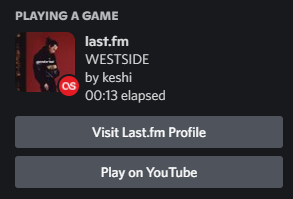

<p align="center">
	<a href="https://last.fm/"></a>
</p>

<h1 align="center">
  lfm-cli
</h1>

<p align="center">
  Show your fellow gamers and friends what you're listening to on Last.FM without touching a single API Key!
</p>

<p align="center">
  
  
  
  
  
</p>

<h2 align="center">
  Sample Images
</h2>
<p align="center">
  <br>
  
</p>

# Usage

lfm-cli works right out of the box - no configuration needed.

To get started, download the latest [release](https://github.com/lfm2discord/lfm2discord-cli/releases). These binaries
are built on GitHub Actions.

**With [Discord](https://discord.com/) open**, run the following binary in your console

```console
foo@bar:~$ lfm-cli -u MYUSERNAME
```

For full reference on flags, run the binary with the `-h` or `--help` flag.
