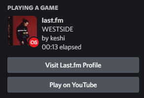
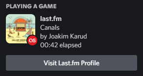

<p align="center">
	<a href="https://last.fm/"></a>
</p>

<h1 align="center">
  lfm-cli
</h1>

<p align="center">
  Show your fellow gamers and friends what you're listening to on Last.FM without touching a single API Key!
</p>

<p align="center">
  
  
  
  
  
</p>

<h2 align="center">
  Sample Images
</h2>
<p align="center">
  <br>
  
</p>

# Getting Started

lfm-cli works right out of the box - no configuration needed.

## Installation

**Homebrew (macOS):**
```console
brew install twangodev/tap/lfm-cli
```

**Scoop (Windows):**
```console
scoop bucket add twangodev https://github.com/twangodev/scoop-bucket
scoop install lfm-cli
```

**Install script (macOS / Linux / FreeBSD):**
```console
curl -fsSL https://twango.dev/install/lfm-cli | sh
```

**Linux packages:** download the `.deb`, `.rpm`, or `.apk` from the
[latest release](https://github.com/twangodev/lfm-cli/releases/latest).

**Manual:** download the archive for your platform from the
[releases page](https://github.com/twangodev/lfm-cli/releases). Releases include
SBOMs and cosign-signed checksums generated on GitHub Actions.

## Usage

**With [Discord](https://discord.com/) open**, run the following binary in your console

```console
foo@bar:~$ lfm-cli -u MYUSERNAME
```

For full reference on flags, run the binary with the `-h` or `--help` flag.
